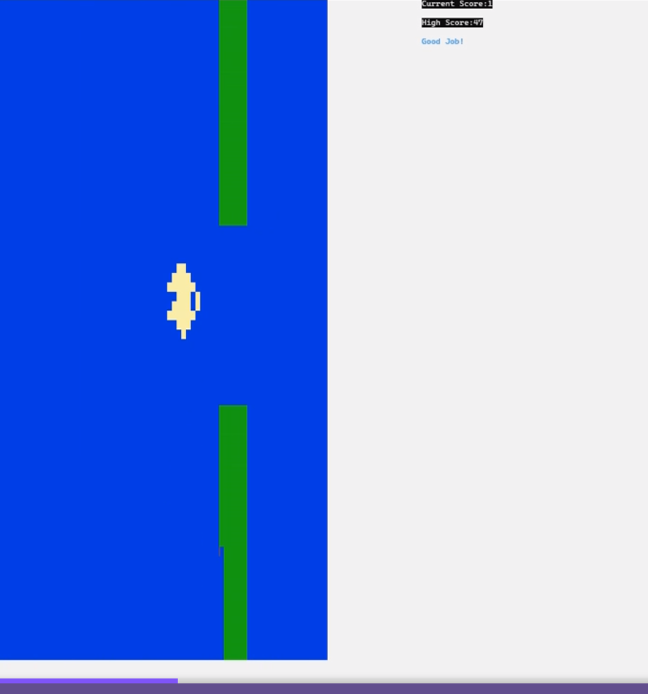
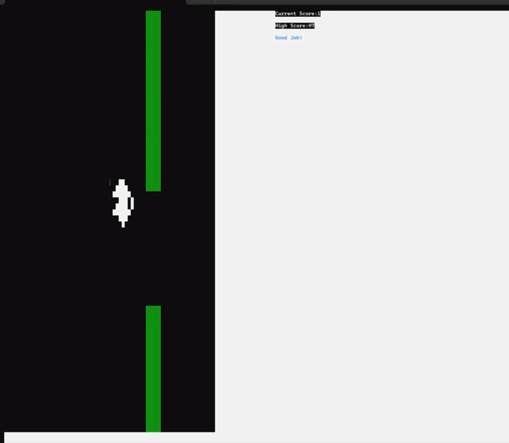
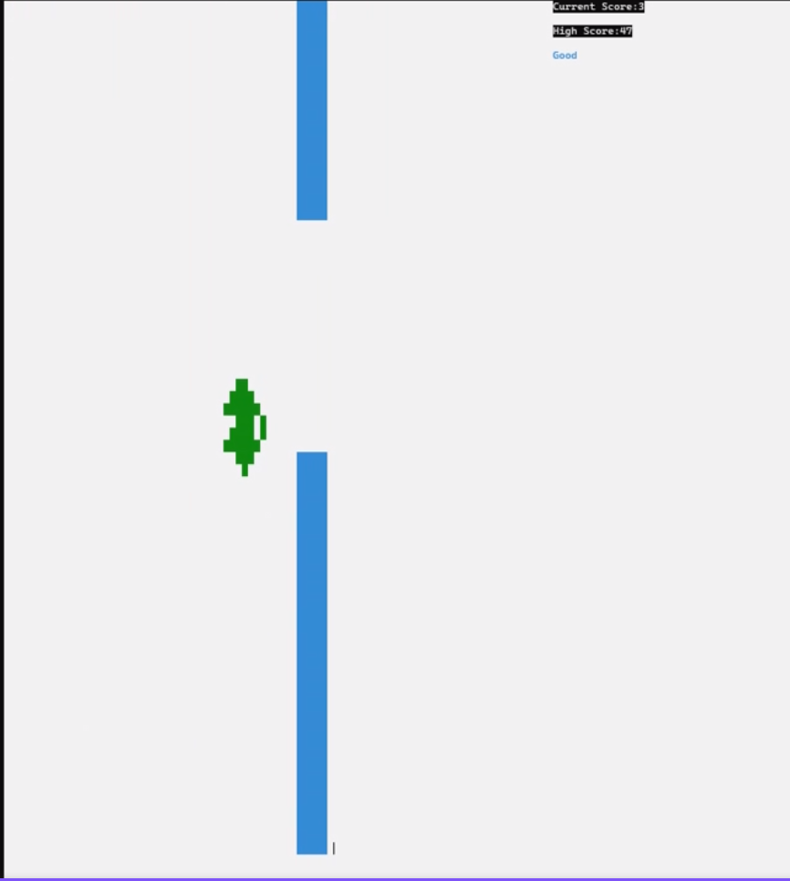
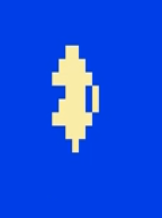
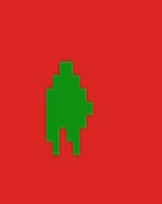

# 🚀 Completed Flappy Bird in MASM (Irvine32)

A classic **Flappy Bird–style game** implemented in **x86 Assembly** using **MASM** and the **Irvine32 library**.

---

## 🛠️ Installation and Setup

The game is **complete**. You have two options for installation:

1.  ### **Recommended (Quick Start)**
    * Download the **executable file (`.exe`)** from the project's **Releases** section.
    * No other dependencies are needed

2.  ### **Assembly and Build**
    * Download the entire project containing the **`.asm` source file**.
    * Ensure you have the **Irvine32 Library** installed and configured (specifically `Irvine32.inc` and `Irvine32.lib`).
    * Assemble and link the project using MASM (e.g., in a Visual Studio environment configured for Assembly).
    * Download the required **`highscore.txt`** file(if not already present) and place it in the same directory as the resulting executable.

---

## ✨ Features

The completed game includes the following functionalities:

* **A. Dynamic Backgrounds (4 Themes)**
    * Change the game's theme and background instantly while playing.

* **B. Selectable Bird Character (2 Options)**
    * Choose your preferred bird graphic during the game.

* **C. Runtime Commentary**
    * The game provides real-time commentary during gameplay.

* **D. High Score Saving**
    * The game saves the highest score achieved to the **`highscore.txt`** file.

---

## 🎮 Gameplay and Controls

| Action | Command Key | Description |
| :---: | :---: | :--- |
| **Jump/Flap** | **W** | Makes the bird move up against gravity. |
| **Select Bird 1** | **A** | Switches the bird character to **Bird 1**. |
| **Select Bird 2** | **D** | Switches the bird character to **Bird 2**. |
| **Change Theme 1** | **1** | Switches the background to **Theme 1**. |
| **Change Theme 2** | **2** | Switches the background to **Theme 2**. |
| **Change Theme 3** | **3** | Switches the background to **Theme 3**. |
| **Change Theme 4** | **4** | Switches the background to **Theme 4**. |

---

## 🖼️ Assets Showcase

### **Background Themes**

| Theme 1 | Theme 2 | Theme 3 | Theme 4 |
|  |  |  || 

### **Bird Characters**

| Bird 1 | Bird 2 |
|  |  |
